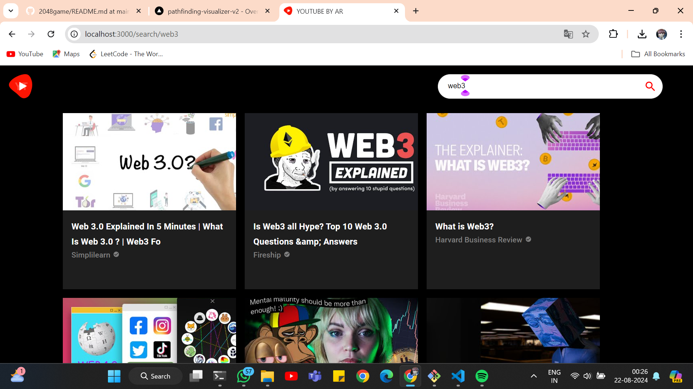
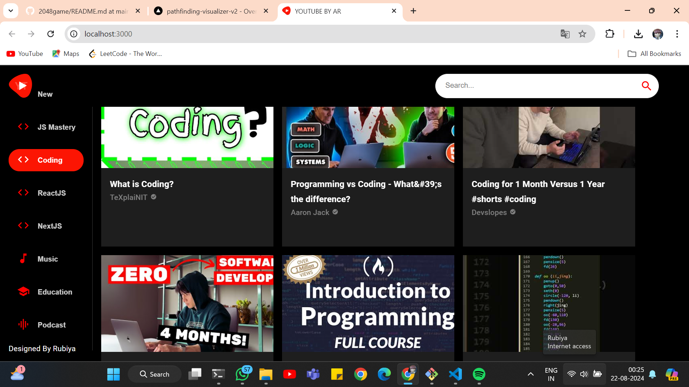
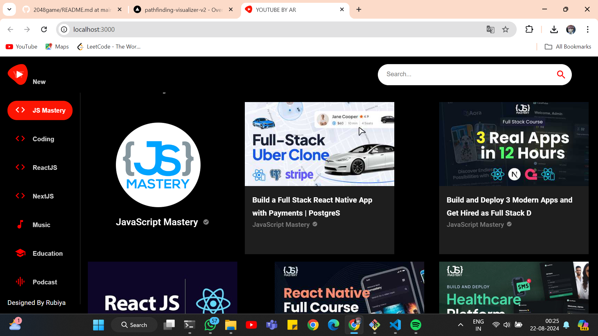
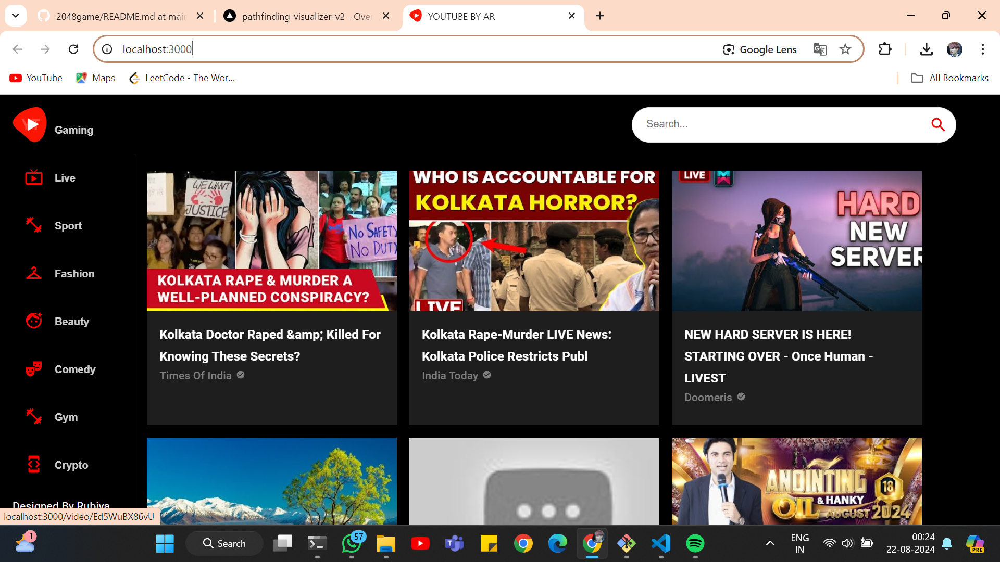

# Build and Deploy a Modern YouTube Clone Application in React JS with Material UI 5


## Project Overview

This project demonstrates how to build a modern YouTube clone using React JS and Material UI 5. It showcases advanced frontend development techniques and the integration of sleek, responsive design elements. 🚀

Explore the live project [here](https://youtube-clone-ten-lime.vercel.app/). 🎥


### Key Features

- **React JS** for building a dynamic user interface.
- **Material UI 5** for modern and responsive design.
- **Authentication** and **video management** features.
- **Responsive Layout** to ensure accessibility on various devices.

## Getting Started

To get a local copy up and running follow these simple steps.

### Prerequisites

- [Node.js](https://nodejs.org/) and [npm](https://www.npmjs.com/) installed on your machine.

### Installation

1. **Clone the Repository:**

   ```bash
   git clone git@github.com:yourusername/your-repository.git

2. **Install Dependencies:**

   ```bash
   npm install

3. ** Start the Development Server**

   ```bash
   npm start

3. **Open Your Browser*

   ```bash
   Visit http://localhost:3000 to view the application.
## Screenshots

### Image 1



### Image 2



### Image 3



### Image 4




Contributing
Contributions are welcome! If you have suggestions or improvements, please open an issue or submit a pull request.

License
This project is licensed under the MIT License.

Contact
For any questions or inquiries, please contact me at asmarubiya456@gmail.com.


